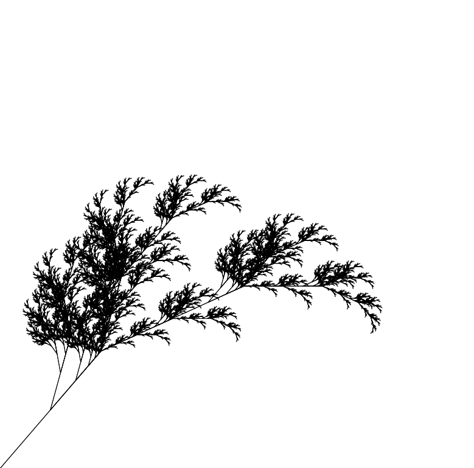
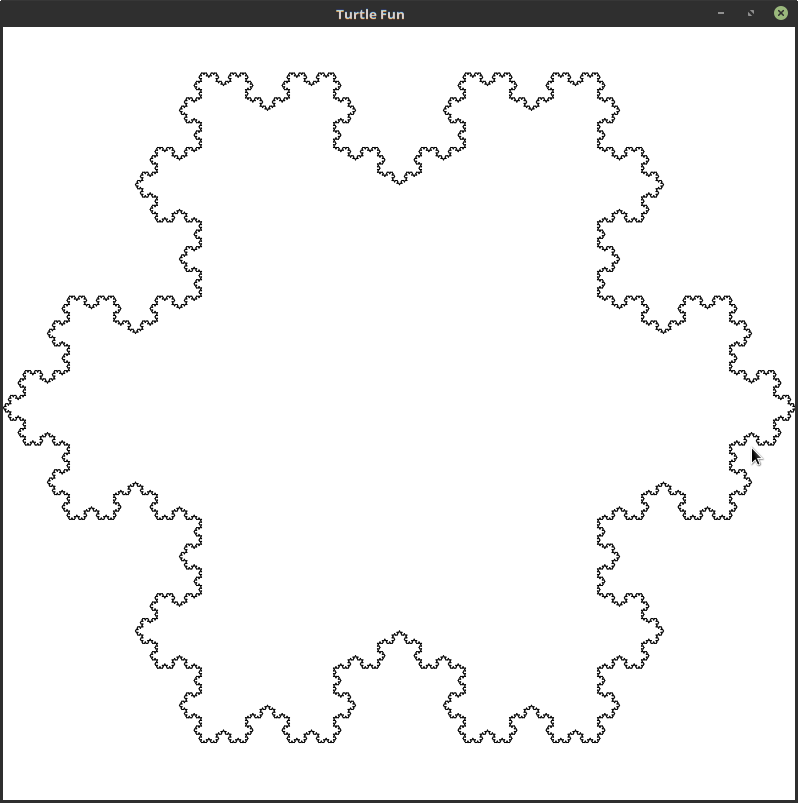

# simple L-System Fractals in F#
having some fun with L-System fractals

For a short introduction to L-Systems see the [wikipedia page on it](https://en.wikipedia.org/wiki/L-system).
The implementation uses string manipulation right now so you might want to improve on that (could take quite some memory for non-small depths).

This little demo uses a simple [turtle-like drawing](https://en.wikipedia.org/wiki/Turtle_graphics) programms to generate those fractals.

In the [source-file](Turtle.fs) you can find examples for 4 fractals - *koch curve*, *snowflake*, *sierpinskis triangle* and a *fractal plant* you can
run them by just replacing the

```fsharp
setTurtleProgramm <| plant 8
``` 

line at the end of the file.

## Setup/Run

On a *nix machine with mono installed you can just run it using

    chmod +x run.sh
    ./run.sh

## Examples

the following snippet/function will generate something similar to the fractal plant found on the wiki-page:

```fsharp
let plant n =
    let d = 100.0f / pown 2.3f n
    let interp =
        function
        | 'F' -> Some <| Turtle.move d
        | '+' -> Some <| Turtle.turnGrad -25.0f
        | '-' -> Some <| Turtle.turnGrad +25.0f
        | '[' -> Some <| Turtle.push
        | ']' -> Some <| Turtle.pop
        | _   -> None
    LSystem.startWith "--X"
    |> LSystem.addRule 'X' "F[-X][X]F[-X]+FX"
    |> LSystem.addRule 'F' "FF"
    |> LSystem.execute interp n
    |> fun cmds -> Turtle.jump (-50.0f, 50.0f) :: cmds
```



---

this will generate snowflake:

```fsharp
let snowFlake n =
    let d = 50.0f / pown 3.0f n
    let interp =
        function
        | 'F' -> Some <| Turtle.move d
        | '+' -> Some <| Turtle.turnGrad 60.0f
        | '-' -> Some <| Turtle.turnGrad -60.0f
        | _   -> None
    LSystem.startWith "Y"
    |> LSystem.addRule 'F' "F+F--F+F"
    |> LSystem.addRule 'Y' "F+F+F+F+F+F"
    |> LSystem.execute interp (n+1)
    |> fun cmds -> Turtle.jump (-25.0f, 42.5f) :: cmds
```

